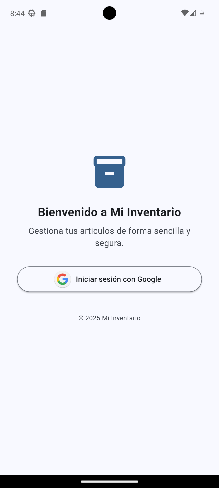
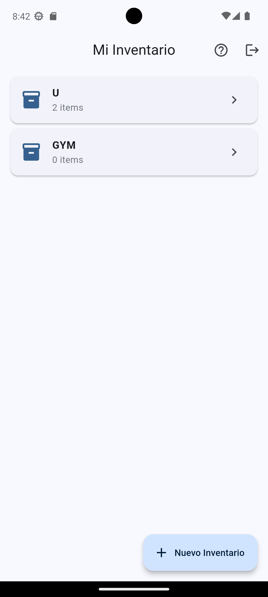
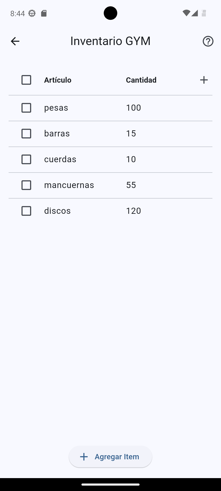

# Mi Inventario

Una aplicación móvil diseñada para gestionar inventarios de manera eficiente y sencilla.

## Descripción General

Mi Inventario es una aplicación que permite a los usuarios gestionar múltiples inventarios de manera organizada y eficiente. Con una interfaz moderna y fácil de usar, los usuarios pueden crear, administrar y compartir sus inventarios con otros usuarios.

## Capturas de Pantalla

### Inicio de Sesión

_Inicio de sesión seguro con Google_

### Lista de Inventarios

_Gestión de múltiples inventarios con interfaz intuitiva_

### Detalles del Inventario

_Vista detallada de items con atributos personalizables_

## Características Principales

### Gestión de Inventarios

- Creación de múltiples inventarios
- Cada inventario cuenta con:
  - Nombre único
  - Administrador principal
  - Capacidad de compartir con otros usuarios
  - Sistema de permisos y roles

### Gestión de Items

- Agregar múltiples items a cada inventario
- Características básicas de items:
  - Nombre del item
  - Cantidad
- Sistema de atributos personalizables:
  - Agregar atributos extra según necesidades
  - Personalización flexible por inventario

### Funcionalidades de Usuario

- Sistema de autenticación seguro
- Gestión de inventarios propios
- Compartir inventarios con otros usuarios
- Control de acceso y permisos

### Interfaz de Usuario

- Diseño moderno y responsive
- Características principales:
  - Lista organizada de inventarios
  - Vista detallada de cada inventario
  - Sistema de edición en tabla
  - Interfaz intuitiva y fácil de usar

## Requisitos del Sistema

- Dispositivo móvil con Android o iOS
- Conexión a Internet
- Cuenta de usuario en la aplicación

## Contacto y Soporte

[Información de contacto y soporte]
